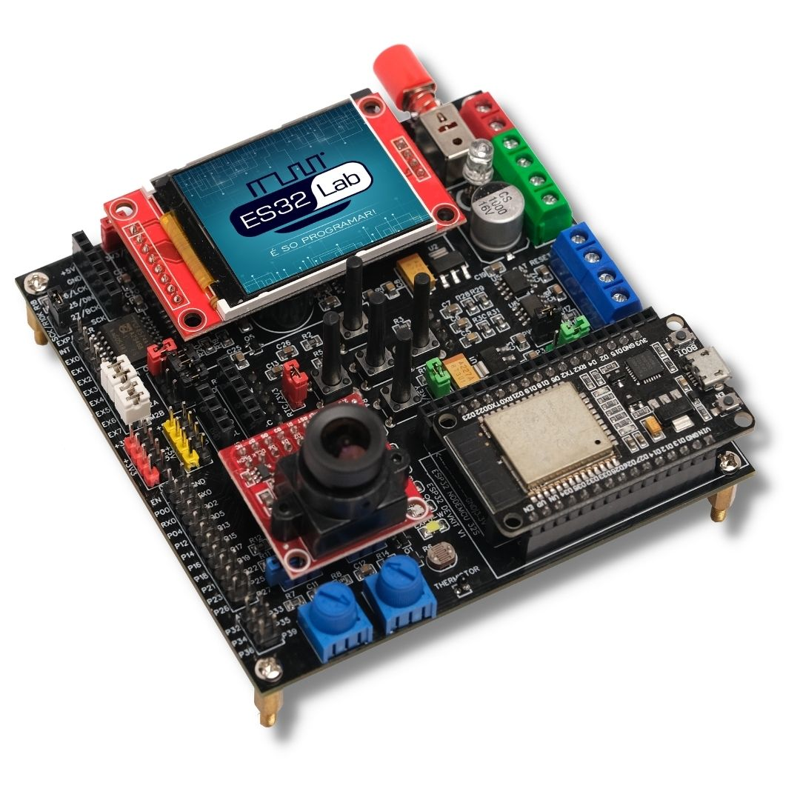
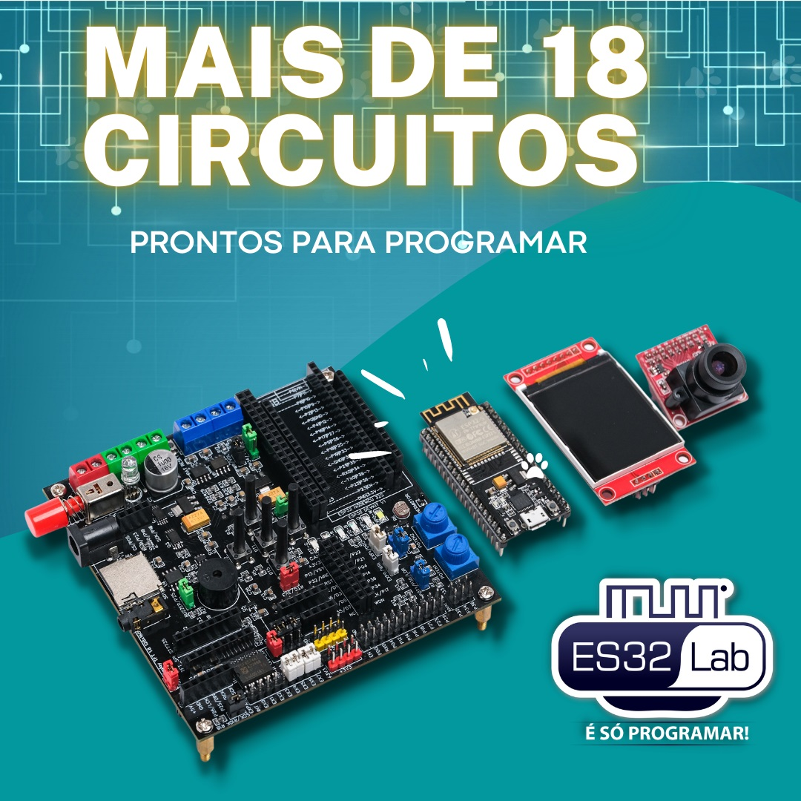
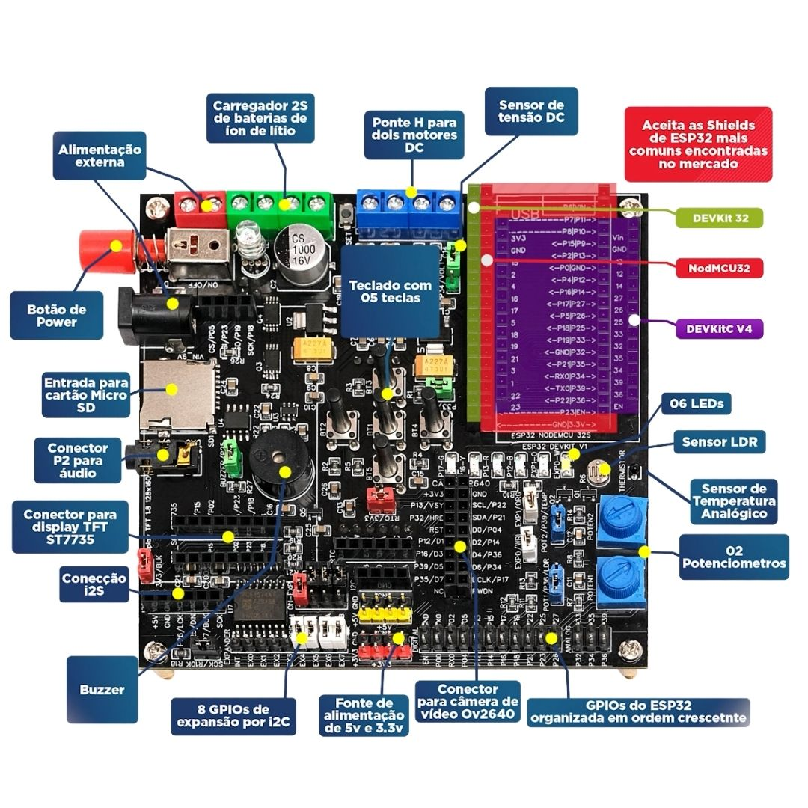
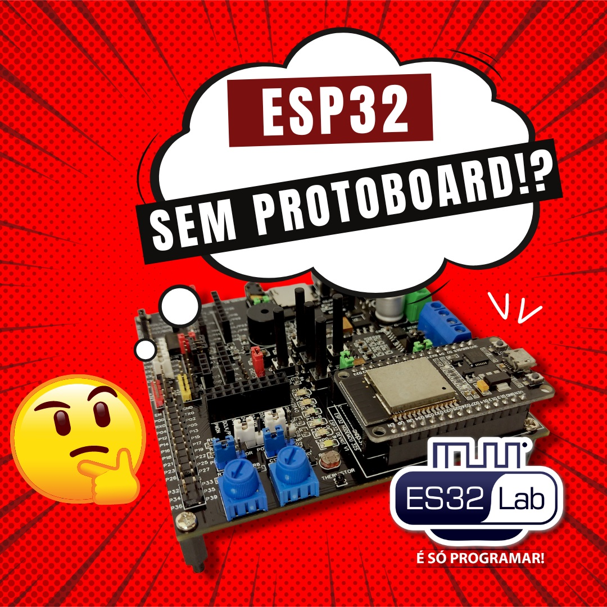

# ES32Lab



A **ES32Lab** é uma placa de desenvolvimento e prototipagem para ESP32 criada para reduzir a quantidade de ligações externas, jumpers, protoboards e circuitos auxiliares em projetos didáticos, experimentais e de robótica.

A proposta é simples: a placa já reúne diversos circuitos prontos para uso, conectores organizados, identificação visual das GPIOs e uma biblioteca C++ própria para facilitar a programação no ecossistema Arduino/ESP32.

> **Site oficial e aquisição:**  
> A ES32Lab pode ser adquirida pelo site oficial da ES Developer:  
> [https://www.esdeveloper.com.br/](https://www.esdeveloper.com.br/)

> **Canal com exemplos em vídeo:**  
> No canal da ES Developer há exemplos práticos, demonstrações e conteúdos de apoio para usar a ES32Lab:  
> [YouTube - ES Developer](https://www.youtube.com/esdeveloperbr?sub_confirmation=1)

> **Assistente IA da ES32Lab:**  
> Também está disponível um assistente de IA próprio para auxiliar usuários da ES32Lab com dúvidas, exemplos e desenvolvimento de projetos:  
> [Assistente IA ES32Lab](https://chatgpt.com/g/g-uwhCVM9MJ-es32lab)

---

## Índice

1. [O que é a ES32Lab?](#o-que-é-a-es32lab)
2. [Mapa Visual dos Circuitos](#mapa-visual-dos-circuitos)
3. [Avisos Elétricos Importantes](#avisos-elétricos-importantes)
4. [Biblioteca ES32Lab](#biblioteca-es32lab)
5. [Instalação](#instalação)
6. [Dependência Obrigatória](#dependência-obrigatória)
7. [Como Incluir no Código](#como-incluir-no-código)
8. [GPIOs e Identificação na Placa](#gpios-e-identificação-na-placa)
9. [Constantes de GPIO](#constantes-de-gpio)
10. [Primeiro Exemplo](#primeiro-exemplo)
11. [Classes Disponíveis](#classes-disponíveis)
12. [Exemplos Prontos](#exemplos-prontos)
13. [Links Úteis](#links-úteis)
14. [Licença](#licença)

---

## O que é a ES32Lab?



A ES32Lab é uma plataforma baseada no ESP32 da Espressif, pensada para acelerar a criação de projetos eletrônicos sem exigir que o usuário monte do zero todos os circuitos auxiliares.

Ela é especialmente útil em:

- aulas de programação embarcada;
- cursos de Arduino, ESP32 e C++;
- experimentos de IoT;
- robótica educacional;
- testes com sensores e atuadores;
- projetos com display TFT;
- projetos com câmera;
- automação e prototipagem rápida.

Entre os principais recursos de hardware disponíveis na placa estão:

- compatibilidade com shields ESP32 comuns, como DEVKit, NodeMCU32 e variações compatíveis;
- fonte de alimentação de 5V e 3.3V;
- entrada para alimentação externa;
- carregador 2S para baterias de íon-lítio;
- ponte H para controle de dois motores DC;
- sensor de tensão DC;
- teclado analógico com 5 teclas;
- 2 potenciômetros;
- 6 LEDs;
- sensor de temperatura analógico;
- sensor LDR;
- leitor de cartão micro SD;
- conector para câmera OV2640;
- conector para display TFT SPI colorido;
- buzzer;
- conector P2 para áudio via DAC do ESP32;
- conexão I2S;
- expansão de GPIOs via I2C com PCF8574;
- GPIOs organizadas e identificadas diretamente na placa.

A ideia central é permitir que o usuário conecte a placa, instale a biblioteca e comece a programar com menos tempo gasto em montagem física.

---

## Mapa Visual dos Circuitos



A imagem acima mostra a localização dos principais circuitos integrados à ES32Lab. Ela é uma referência importante durante o desenvolvimento, pois ajuda o usuário a identificar rapidamente conectores, sensores, LEDs, alimentação, expansão I2C, ponte H, display, câmera e demais recursos da placa.

Além do mapa visual, a própria placa possui descrições impressas próximas aos pinos e circuitos. Isso permite programar olhando diretamente para a identificação física da ES32Lab.

Exemplo:

- `P17_G` indica a GPIO 17 associada ao LED verde;
- `P16_Y` indica a GPIO 16 associada ao LED amarelo;
- `P13_R` indica a GPIO 13 associada ao LED vermelho;
- `P12_B` indica a GPIO 12 associada ao LED azul.

Na biblioteca, essas identificações também existem como constantes, facilitando o uso direto no código.

---

## Avisos Elétricos Importantes

Antes de alimentar a placa ou conectar motores, leia estes pontos com atenção.

### Alimentação externa

- A alimentação externa da ES32Lab **não deve ultrapassar 9V**.
- O conector de alimentação externa deve ser usado com **positivo no pino central**.
- Confira a polaridade da fonte antes de ligar a placa.
- Fontes com tensão, polaridade ou corrente inadequadas podem danificar a ES32Lab, o ESP32 ou os periféricos conectados.

### Uso da ponte H e motores DC

A ES32Lab possui uma ponte H baseada no driver L9110S para controle de motores DC. Esse recurso é útil para projetos de robótica, carrinhos, seguidores de linha e experimentos com atuadores.

Ao usar motores na ponte H:

- os motores ligados à ponte H **não devem exceder corrente de 1 A por saída/canal do driver L9110S**;
- considere que motores DC podem consumir corrente muito maior na partida ou quando travados;
- use motores compatíveis com a capacidade da ponte H;
- se o motor exigir mais corrente, use um driver externo apropriado.

> **Importante:**  
> Para usar motores na ponte H, a placa precisa de uma alimentação extra adequada, como fonte externa ou baterias de lítio compatíveis. A alimentação via USB do computador não deve ser usada como fonte principal para motores.

Em resumo: o cabo USB é adequado para programação, comunicação serial e alimentação de circuitos leves. Para motores, use alimentação externa.

---

## Biblioteca ES32Lab

A biblioteca **ES32Lab** foi criada para facilitar o uso dos circuitos da placa por meio de constantes, classes e exemplos prontos.

Com ela, o usuário pode escrever:

```cpp
#include <ES32Lab.h>
```

e ter acesso a:

- constantes de GPIO organizadas;
- classes para periféricos da placa;
- atalhos para sensores, atuadores e módulos integrados;
- exemplos prontos para Arduino IDE e PlatformIO;
- integração com câmera, display, cartão SD, buzzer, botões, motores e outros recursos.

A versão atual da biblioteca pode ser consultada pela macro:

```cpp
ES32LAB_VERSION
```

Exemplo:

```cpp
Serial.println(ES32LAB_VERSION);
```

---

## Instalação

### Arduino IDE

A biblioteca **ES32Lab** está disponível para instalação pela própria Arduino IDE, usando o **Gerenciador de Bibliotecas**.

Procedimento geral:

1. Abra a Arduino IDE.
2. Acesse **Sketch > Incluir Biblioteca > Gerenciar Bibliotecas**.
3. Pesquise por `ES32Lab`.
4. Instale a biblioteca.
5. Verifique se a dependência `TFT_eSPI_ES32Lab` também foi instalada.

### VS Code com PlatformIO

Usuários do VS Code com PlatformIO também podem instalar a biblioteca pelo **PlatformIO Registry** ou pela interface **PIO Home**.

Em projetos PlatformIO, a biblioteca também pode ser adicionada ao `platformio.ini`:

```ini
lib_deps =
    ESDeveloperBR/ES32Lab
    ESDeveloperBR/TFT_eSPI_ES32Lab
```

> **Nota:**  
> A dependência `TFT_eSPI_ES32Lab` é obrigatória. Mesmo que o gerenciador de bibliotecas tente resolver dependências automaticamente, recomenda-se conferir se ela está instalada corretamente.

### Instalação manual

Também é possível instalar manualmente pelo GitHub:

- [Repositório ES32Lab](https://github.com/ESDeveloperBR/ES32Lab)
- [Repositório TFT_eSPI_ES32Lab](https://github.com/ESDeveloperBR/TFT_eSPI_ES32Lab)

---

## Dependência Obrigatória

A biblioteca ES32Lab depende obrigatoriamente da biblioteca:

- [`TFT_eSPI_ES32Lab`](https://github.com/ESDeveloperBR/TFT_eSPI_ES32Lab)

Essa dependência é uma versão derivada da biblioteca original [`Bodmer/TFT_eSPI`](https://github.com/Bodmer/TFT_eSPI), porém ajustada para a ES32Lab. Ela já vem preparada para o display TFT da placa, evitando que o usuário precise configurar manualmente as GPIOs e parâmetros de hardware do display.

> **Atenção:**  
> Para usar a ES32Lab, instale a `TFT_eSPI_ES32Lab`. A biblioteca original `TFT_eSPI` não substitui a versão ajustada para a placa ES32Lab neste ecossistema.

---

## Como Incluir no Código

Depois de instalar a biblioteca, basta incluir:

```cpp
#include <ES32Lab.h>
```

Esse cabeçalho centraliza as principais constantes e classes da biblioteca.

Exemplo mínimo:

```cpp
#include <Arduino.h>
#include <ES32Lab.h>

void setup() {
    Serial.begin(115200);
    Serial.println(ES32LAB_VERSION);
}

void loop() {

}
```

---

## GPIOs e Identificação na Placa

Uma das facilidades da ES32Lab é que as GPIOs e funções principais estão descritas na própria placa.

Isso reduz a necessidade de consultar esquemas a todo momento. Em muitos casos, basta olhar a identificação impressa na ES32Lab e usar a constante correspondente no código.

Exemplo:

```cpp
pinMode(P17_G, OUTPUT);
digitalWrite(P17_G, HIGH);
```

Também é possível usar o nome funcional:

```cpp
pinMode(P_LED_GREEN, OUTPUT);
digitalWrite(P_LED_GREEN, HIGH);
```

As duas formas apontam para a mesma GPIO 17. A primeira acompanha a identificação física da placa; a segunda descreve a função do circuito.

---

## Constantes de GPIO

### Labels impressos na ES32Lab

Essas constantes correspondem aos labels de GPIO impressos na placa:

| Constante | GPIO |
| :------ | :------ |
| `P00` | GPIO 0 |
| `P01` | GPIO 1 |
| `P02` | GPIO 2 |
| `P03` | GPIO 3 |
| `P04` | GPIO 4 |
| `P05` | GPIO 5 |
| `P12` / `P12_B` | GPIO 12 |
| `P13` / `P13_R` | GPIO 13 |
| `P14` | GPIO 14 |
| `P15` | GPIO 15 |
| `P16` / `P16_Y` | GPIO 16 |
| `P17` / `P17_G` | GPIO 17 |
| `P18` | GPIO 18 |
| `P19` | GPIO 19 |
| `P21` | GPIO 21 |
| `P22` | GPIO 22 |
| `P23` | GPIO 23 |
| `P25` | GPIO 25 |
| `P26` | GPIO 26 |
| `P27` | GPIO 27 |
| `P32` | GPIO 32 |
| `P33` | GPIO 33 |
| `P34` | GPIO 34 |
| `P35` | GPIO 35 |
| `P36` | GPIO 36 |
| `P39` | GPIO 39 |

### Comunicação

| Constante | GPIO | Uso |
| :------ | :------ | :------ |
| `TX0` | GPIO 1 | Serial TX0 |
| `RX0` | GPIO 3 | Serial RX0 |
| `SDA` | GPIO 21 | I2C SDA |
| `SCL` | GPIO 22 | I2C SCL |
| `MOSI` | GPIO 23 | SPI MOSI |
| `MISO` | GPIO 19 | SPI MISO |
| `SCK` | GPIO 18 | SPI Clock |
| `LCK` | GPIO 26 | I2S LRC/Word Select |
| `DIN` | GPIO 25 | I2S Data |
| `BCK` | GPIO 27 | I2S Bit Clock |

### SD e TFT

| Constante | GPIO | Uso |
| :------ | :------ | :------ |
| `CS_SD` | GPIO 5 | Chip Select do cartão SD |
| `CS_TFT` | GPIO 15 | Chip Select do display TFT |
| `DC_TFT` / `A0_TFT` | GPIO 2 | Data/Command do display TFT |
| `DA_TFT` | GPIO 23 | Dados SPI do display TFT |
| `CL_TFT` | GPIO 18 | Clock SPI do display TFT |

### Periféricos onboard

| Constante | GPIO | Uso |
| :------ | :------ | :------ |
| `P_KEYBOARD` | GPIO 33 | Teclado analógico |
| `P_LED_GREEN` | GPIO 17 | LED verde |
| `P_LED_YELLOW` | GPIO 16 | LED amarelo |
| `P_LED_RED` | GPIO 13 | LED vermelho |
| `P_LED_BLUE` | GPIO 12 | LED azul |
| `P_POT1` | GPIO 36 | Potenciômetro 1 |
| `P_POT2` | GPIO 39 | Potenciômetro 2 |
| `P_VOLT` | GPIO 34 | Sensor de tensão |
| `P_BUZZER` | GPIO 25 | Buzzer |
| `P_DAC1` | GPIO 25 | DAC canal L quando usado como áudio |
| `P_DAC2` | GPIO 26 | DAC canal R quando usado como áudio |

---

## Primeiro Exemplo

Este exemplo pisca o LED verde onboard da ES32Lab.

```cpp
#include <Arduino.h>
#include <ES32Lab.h>

void setup() {
    pinMode(P_LED_GREEN, OUTPUT);
}

void loop() {
    digitalWrite(P_LED_GREEN, HIGH);
    delay(500);

    digitalWrite(P_LED_GREEN, LOW);
    delay(500);
}
```

O mesmo exemplo também poderia ser escrito usando a identificação impressa na placa:

```cpp
pinMode(P17_G, OUTPUT);
digitalWrite(P17_G, HIGH);
```

---

## Classes Disponíveis

A biblioteca ES32Lab possui classes específicas para facilitar o uso dos circuitos da placa e de recursos comuns em projetos com ESP32.

| Classe | Finalidade | Documentação |
| :------ | :------ | :------ |
| `ES_AnalogKeyboard` | Leitura do teclado analógico de 5 teclas. | [README](src/ES_AnalogKeyboard/README.md) |
| `ES_DigitalButton` | Leitura de botões digitais com tratamento de estado. | [README](src/ES_DigitalButton/README.md) |
| `ES_Buzzer` | Controle de buzzer e reprodução de tons. | [README](src/ES_Buzzer/README.md) |
| `ES_Camera` | Inicialização e captura com câmera OV2640. | [README](src/ES_Camera/README.md) |
| `ES_CarControl` | Controle de robôs/carrinhos com dois motores DC. | [README](src/ES_CarControl/README.md) |
| `ES_CarLineFollower` | Controle didático de robô seguidor de linha. | [README](src/ES_CarLineFollower/README.md) |
| `ES_File` | Apoio para manipulação e navegação de arquivos. | [README](src/ES_File/README.md) |
| `ES_PCF8574` | Expansão de GPIOs via I2C usando PCF8574. | [README](src/ES_PCF8574/README.md) |
| `ES_TFT` | Controle do display TFT e renderização de imagens. | [README](src/ES_TFT/README.md) |
| `ES_TimeInterval` | Controle de intervalos de tempo sem bloquear o programa. | [README](src/ES_TimeInterval/README.md) |

Cada classe possui documentação própria com exemplos, parâmetros e observações de uso.

---

## Exemplos Prontos

A biblioteca ES32Lab acompanha diversos exemplos prontos para uso, organizados por recurso.

| Recurso | Exemplos |
| :------ | :------ |
| LEDs | [examples/LEDs](examples/LEDs) |
| Teclado analógico | [examples/AnalogKeyboard](examples/AnalogKeyboard) |
| Botão digital | [examples/DigitalButton](examples/DigitalButton) |
| Buzzer | [examples/Buzzer](examples/Buzzer) |
| Câmera OV2640 | [examples/Camera](examples/Camera) |
| Display TFT | [examples/Display-TFT](examples/Display-TFT) |
| Arquivos, SD, SPIFFS e LittleFS | [examples/File](examples/File) |
| Expansor I2C PCF8574 | [examples/i2C_Expander](examples/i2C_Expander) |
| Potenciômetros | [examples/Potentiometer](examples/Potentiometer) |
| Controle de carro/robô | [examples/CarControl](examples/CarControl) |
| Robô seguidor de linha | [examples/CarLineFollower](examples/CarLineFollower) |
| Controle de tempo | [examples/TimeInterval](examples/TimeInterval) |
| Projetos completos | [examples/FullProjects](examples/FullProjects) |

Quando uma categoria possui mais de um exemplo, o link aponta para a pasta correspondente, onde estão os arquivos `.ino` prontos para abrir na Arduino IDE ou consultar no PlatformIO.

Os exemplos podem ser acessados pela pasta:

```text
examples/
```

Na Arduino IDE, eles ficam disponíveis pelo menu:

```text
Arquivo > Exemplos > ES32Lab
```

No PlatformIO, os exemplos podem ser consultados diretamente na pasta `examples` da biblioteca ou do repositório.

---

## Links Úteis

- [Site oficial da ES Developer](https://www.esdeveloper.com.br/)
- [Canal ES Developer no YouTube](https://www.youtube.com/esdeveloperbr?sub_confirmation=1)
- [Assistente IA ES32Lab](https://chatgpt.com/g/g-uwhCVM9MJ-es32lab)
- [Repositório ES32Lab](https://github.com/ESDeveloperBR/ES32Lab)
- [Biblioteca TFT_eSPI_ES32Lab](https://github.com/ESDeveloperBR/TFT_eSPI_ES32Lab)
- [Vídeo de introdução da ES32Lab](https://www.youtube.com/watch?v=F3Kxc9TrW4A)
- [ESP32 sem protoboard!? Conheça cada detalhe do hardware da ES32Lab](https://www.youtube.com/watch?v=xpoNbSA8pPM)



---

## Licença

Esta biblioteca é distribuída sob a licença MIT. Consulte o arquivo [`LICENSE`](LICENSE) para mais detalhes.
