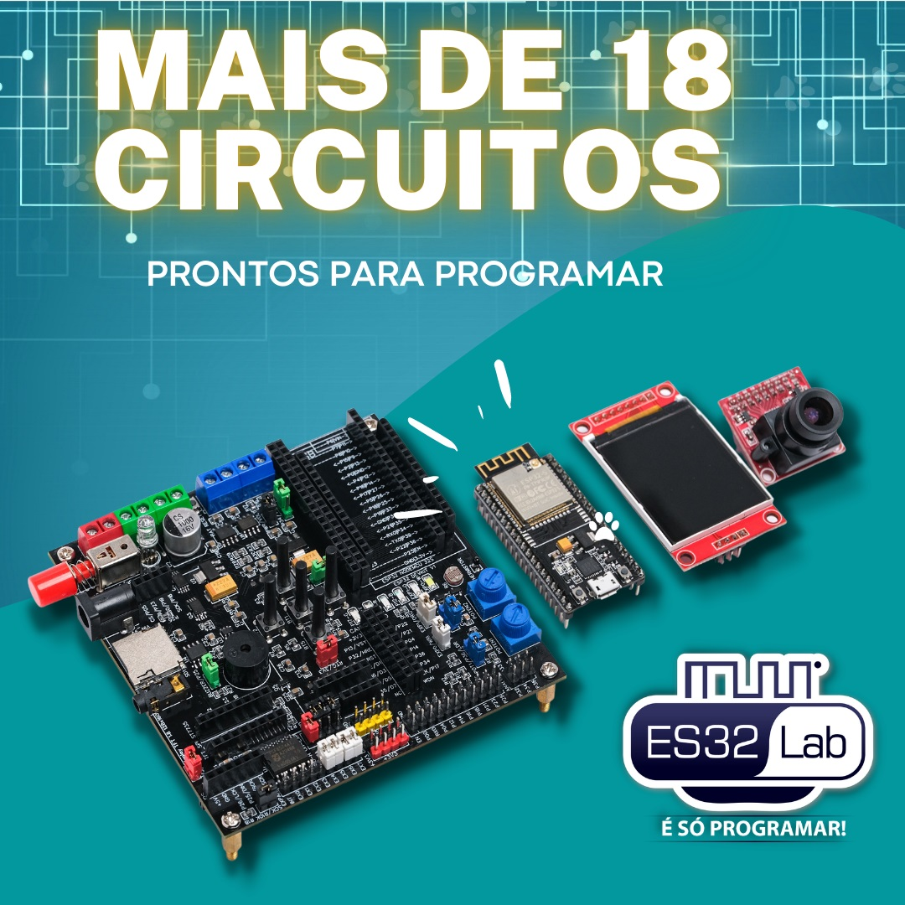

# Índice
* [Introdução](https://github.com/ESDeveloperBR/ES32Lab#introdu%C3%A7%C3%A3o)
  * [O que é o projeto ES32Lab?](https://github.com/ESDeveloperBR/ES32Lab#o-que-%C3%A9-o-projeto-es32lab)
  * [ESP32 sem protoboard!? Conheça cada detalhe do hardware da ES32Lab](https://github.com/ESDeveloperBR/ES32Lab#esp32-sem-protoboard-conhe%C3%A7a-cada-detalhe-do-hardware-da-es32lab)
* [ES32Lab biblioteca](https://github.com/ESDeveloperBR/ES32Lab#es32lab-biblioteca)
	* [Endereço das GPIOs do ESP32 com conexões aos circuitos da ES32Lab](https://github.com/ESDeveloperBR/ES32Lab#endere%C3%A7o-das-gpios-do-esp32-com-conex%C3%B5es-aos-circuitos-da-es32lab)
	* [Exemplo de utilização de GPIO](https://github.com/ESDeveloperBR/ES32Lab#exemplo-de-utiliza%C3%A7%C3%A3o-de-gpio)
	* [Conjunto de classes contidas na LIB ES32Lab](https://github.com/ESDeveloperBR/ES32Lab#conjunto-de-classes-contidas-na-lib-es32lab)
		* [Classe AnalogKeyboard](https://github.com/ESDeveloperBR/ES32Lab#classe-analogkeyboard)
		* [Classe BuzzerESP](https://github.com/ESDeveloperBR/ES32Lab#classe-buzzeresp)
		* [Classe DigitalButton](https://github.com/ESDeveloperBR/ES32Lab#classe-digitalbutton)
		* [Classe FileManager](https://github.com/ESDeveloperBR/ES32Lab#classe-filemanager)
		* [Classe TFT_Plus](https://github.com/ESDeveloperBR/ES32Lab#classe-tft_plus)
		* [Classe TimeInterval](https://github.com/ESDeveloperBR/ES32Lab#classe-timeinterval)


# Introdução
## O que é o projeto ES32Lab?

[YouTube - Vídeo de introdução](https://www.youtube.com/watch?v=F3Kxc9TrW4A)

A ES32Lab é um conjunto de circuitos eletrônicos montados, com o objetivo de facilitar a utilização e estudo do microcontrolador da ESPRESSIF ESP32, que está disponível no mercado como uma alternativa mais potente e contemporânea se comparado ao consagrado Arduino.
Aplicações e circuitos onboard da ES32Lab:
- Aceita as seguintes Shields de ESP32: DEVKit32S, DEVKit32C V4 e NodeMCU32;
- Fonte de 5v e 3.3v;
- Carregador 2S de baterias de íon lítio;
- Ponte H para dois motores DC;
- Sensor de tensão DC;
- Teclado com 5 teclas;
- 2 Potenciômetros;
- 6 LEDs;
- Sensor de temperatura analógico;
- Sensor LDR;
- Leitor de cartão micro SD;
- Conector pronto para câmera de vídeo OV2640;
- GPIOs do ESP32 organizadas em ordem crescente;
- Expansão de 8 GPIOs extras por i2C;
- Conexão ponta para RTC físico i2C;
- Buzzer;
- Conector P2 para testes com áudio com a porta DAC nativa do ESP32;
- Conector para expansões i2S;
- Conector para os dois modelos mais comuns de display SPI TFT colorido;
- Tamanho de 10x10cm;
- Cabe dentro de uma caixa de passagem elétrica;
Uma característica importante na ES32Lab é a agilidade no desenvolvimento de projetos utilizando o microcontrolador da ESPRESSIF ESP32, visto que seu conjunto de circuitos eletrônicos atende a necessidade de uma gama enorme de projetos e ainda dispensa a utilização de cases especializados, podendo ser acomodada em uma simples caixa de passagem elétrica comprada em qualquer loja de materiais de construção.

## ESP32 sem protoboard!? Conheça cada detalhe do hardware da ES32Lab

[YouTube - ESP32 sem protoboard!? Conheça cada detalhe do hardware da ES32Lab](https://www.youtube.com/watch?v=xpoNbSA8pPM)

Conheça cada detalhe de configuração do hardware da ES32Lab de forma simples e intuitiva. Crie projetos com ESP32 do zero em tempo recorde com essa poderosa ferramenta de desenvolvimento e prototipagem, assista o vídeo e veja com é simples ajustar o hardware da ES32Lab para atender seu projeto.

Tópicos importantes do vídeo explicativo no YouTube:
- [Compatível com diversas shields de ESP32;](https://youtu.be/xpoNbSA8pPM?t=40)
- [Alimentaçãode tensão da ES32Lab;](https://youtu.be/xpoNbSA8pPM?t=107)
- [Circuitos e conectores da ES32Lab;](https://youtu.be/xpoNbSA8pPM?t=182)
- [Parte inferior da ES32Lab;](https://youtu.be/xpoNbSA8pPM?t=234)
- [Legendas de fácil compreensão;](https://youtu.be/xpoNbSA8pPM?t=251)
- [Configuração e ajustes intuitivos;](https://youtu.be/xpoNbSA8pPM?t=292)
- [Tamanho compacto;](https://youtu.be/xpoNbSA8pPM?t=450)


# ES32Lab biblioteca

Para o funcionamento da biblioteca ES32Lab é necessário atualmente a instalação obrigatória da dependência [TFT_eSPI_ES32Lab](https://github.com/ESDeveloperBR/TFT_eSPI_ES32Lab), que é uma variação da biblioteca TFT_eSPI de licença MIT desenvolvida por [Bobmer]( https://github.com/Bodmer).

**ATENÇÃO!** Logo para o funcionamento da biblioteca ES32Lab, torna-se indispensável o download da biblioteca [TFT_eSPI_ES32Lab](https://github.com/ESDeveloperBR/TFT_eSPI_ES32Lab).

## Endereço das GPIOs do ESP32 com conexões aos circuitos da ES32Lab

Para facilitar a programação da ES32Lab foram criadas diversas constantes com os endereços de todas as GPIOs do ESP32 que estão conectadas aos diversos circuitos da ES32Lab, dispensando assim que o programador precise memorizar as GPIOs que estão ligadas aos circuitos da ES32Lab, são elas:
- P_KEYBOARD = GPIO33
- P_LED_GREEN = GPIO17
- P_LED_YELLON= GPIO16
- P_LED_RED = GPIO13
- P_LED_BLUE = GPIO12
- P_POT1 = GPIO36
- P_POT2 = GPIO39
- P_VOLTAGE_SENSOR = GPIO34
- P_BUZZER = GPIO25
- P_DAC1 = GPIO25  // Se a DAC for utilizada como áudio, será o canal L
- P_DAC2 = GPIO26  // Se a DAC for utilizada como áudio, será o canal R
- P_I2S_DOUT = GPIO25
- P_I2S_LRC = GPIO26
- P_I2S_BCLK = GPIO27
- P_SDA = GPIO21
- P_SCL = GPIO22
- P_TX0 = GPIO1
- P_RX0 = GPIO3
- P_TX2 = GPIO17
- P_RX2 = GPIO16
- P_MOSI = GPIO23
- P_MISSO = GPIO19
- P_SCK = GPIO18
- P_SD_CS = GPIO5

## Exemplo de utilização de GPIO

Para exemplificar a utilização das constantes citadas acima, usarei como exemplo um código para piscar de forma intermitente o LED verde da ES32Lab.
```C++
#include <ES32Lab.h>
void setup() {
  pinMode(P_LED_GREEN , OUTPUT);
}
void loop() {
  digitalWrite(P_LED_GREEN, HIGH);
  delay(500);

  digitalWrite(P_LED_GREEN, LOW);
  delay(500);
}
```
Nesse exemplo a GPIO utilizada para controlar o LED verde foi a 17 que pode ser substituída pela constante P_LED_GREEN, dispensando assim que o programador tenha que memorizar todos os endereços GPIOs utilizadas pela ES32Lab.
Todas as constantes de endereços seguem a mesma linha de raciocínio em sua nomenclatura, tonando assim mais intuitiva sua utilização. No exemplo abaixo explicarei o raciocíno a qual foi utilizado para a criação te dotas as constantes de GPIOs na ES32Lab.
P_LED_GREEN: 
* _*“P”:*_ Pino;
* _*“LED”:*_ Circuito na ES32Lab;
* _*“GREEN”:*_ Cor do LED;

Se seguirmos essa linha de raciocínio, a constante de controle do LED vermelho será a P_LED_RED, a do buzzer será a P_BUZZER, potenciômetro 1 será P_POT1 e assim por diante.

## Conjunto de classes contidas na LIB ES32Lab
A biblioteca da ES32Lab conta com diversas classes para programação orientada a objeto, que tem como objetivo facilitar a criação de programas em C++ para controle da placa de desenvolvimento e prototipagem ES32Lab, são elas:
* [AnalogKeyboard](https://github.com/ESDeveloperBR/ES32Lab#classe-analogkeyboard)
* [BuzzerESP](https://github.com/ESDeveloperBR/ES32Lab#classe-buzzeresp)
* [DigitalButton](https://github.com/ESDeveloperBR/ES32Lab#classe-digitalbutton)
* [FileManager](https://github.com/ESDeveloperBR/ES32Lab#classe-filemanager)
* [TFT_Plus](https://github.com/ESDeveloperBR/ES32Lab#classe-tft_plus)
* [TimeInterval](https://github.com/ESDeveloperBR/ES32Lab#classe-timeinterval)


### Classe AnalogKeyboard
A classe _AnalogKeyboard_ é responsável pelo funcionamento do teclado analógico de 5 teclas da placa ES32Lab, sua estrutura é constituída da seguinte forma:
#### Construtor
_AnalogKeyboard(uint8_t pinKeyboard, uint16_t addressKey0 = 0, uint16_t addressKey1 = 870, uint16_t addressKey2 = 1657, uint16_t addressKey3 = 2457, uint16_t addressKey4 = 3322, uint8_t readingAccuracy = 21 );_

No momento da criação de um objeto derivado da classe _AnalogKeyboard_ pode-se passar alguns valores de ajustes, como:
* _**pinKeyboard:**_ Pino (GPIO) ao qual será conectado o teclado analógico da placa ES32Lab ao ESP32. Exemplo: _ AnalogKeyboard keyboard(P_KEYBOARD);_
* _**addressKey0:**_ Endereço analógico para a leitura da tecla “0” do teclado analógico da placa ES32Lab. O valor padrão é o ideal para um bom funcionamento;
* _**addressKey1:**_ Endereço analógico para a leitura da tecla “1” do teclado analógico da placa ES32Lab. O valor padrão é o ideal para um bom funcionamento;
* _**addressKey2:**_ Endereço analógico para a leitura da tecla “2” do teclado analógico da placa ES32Lab. O valor padrão é o ideal para um bom funcionamento;
* _**addressKey3:**_ Endereço analógico para a leitura da tecla “3” do teclado analógico da placa ES32Lab. O valor padrão é o ideal para um bom funcionamento;
* _**addressKey4:**_ Endereço analógico para a leitura da tecla “4” do teclado analógico da placa ES32Lab. O valor padrão é o ideal para um bom funcionamento;
* _**readingAccuracy:**_ Ajuste de tolerância de erros na leitura analógica do teclado. O valor padrão é o ideal para um bom funcionamento;

#### Métodos
* _**boolean press(uint8_t key) :**_ Retorna verdadeiro quando **a tecla for pressionada.** O número da tecla deverá ser repassado pelo parâmetro _key_;
* _**boolean release(uint8_t key) :**_ Retorna verdadeiro quando **a tecla for solta.** O número da tecla deverá ser repassado pelo parâmetro _key_;
* _**boolean hold(uint8_t key):**_ Retorna verdadeiro enquanto **a tecla estiver pressionada.** O número da tecla deverá ser repassado pelo parâmetro _key_;

#### Exemplo prático:
Nesse exemplo toda vez que for pressionado uma tecla, será enviado uma mensagem para o terminal serial informando qual tecla foi pressionada.
```C++
#include <ES32Lab.h>
AnalogKeyboard keyboard(P_KEYBOARD);
void setup() {
  Serial.begin(115200);
}
void loop() {
  if(keyboard.press(0)){
    Serial.println("Key 0 - PRESS");
  }
  if(keyboard.press(1)){
    Serial.println("Key 1 - PRESS");
  }
  if(keyboard.press(2)){
    Serial.println("Key 2 - PRESS");
  }
  if(keyboard.press(3)){
    Serial.println("Key 3 - PRESS");
  }
  if(keyboard.press(4)){
    Serial.println("Key 4 - PRESS");
  }
}
```

### Classe BuzzerESP
A classe _BuzzerESP_ tem como objetivo executar bips e melodias no buzzer da placa ES32Lab através de comandos de alto nível.

#### Construtor
_BuzzerESP(int pinBuzzer, int channel = 0);_
No momento da criação de um objeto derivado da classe _BuzzerESP_, pode-se passar alguns parâmetros:
* _**pinBuzer:**_ Pino (GPIO) ao qual será conectado do buzzer ao ESP32;
* _**channel:**_ Canal PWM que será utilizado para execução dos sons no buzzer;

#### Métodos
* _**begin(int pause):**_ Esse método é utilizado para dar uma pausa em milissegundos no **início** de uma música ou bip;
* _**end(int pause):**_ Esse método é utilizado para dar uma pausa em milissegundos no **final** de uma música ou bip;
* _**sound(int note, int duration):**_ Esse método executa uma nota musical e estabelece o seu tempo de duração em milissegundos;
* _**distortion(int noteFrom, int noteTo):**_ Método responsável em criar uma distorção entre duas notas musicais;

#### Notas musicais
NOTE_C0, NOTE_CS0, NOTE_D0, NOTE_DS0, NOTE_E0, NOTE_F0, NOTE_FS0, NOTE_G0, NOTE_GS0, NOTE_A0, NOTE_AS0, NOTE_B0, NOTE_C1, NOTE_CS1, NOTE_D1, NOTE_DS1, NOTE_E1, NOTE_F1, NOTE_FS1, NOTE_G1, NOTE_GS1, NOTE_A1, NOTE_AS1, NOTE_B1, NOTE_C2, NOTE_CS2, NOTE_D2, NOTE_DS2, NOTE_E2, NOTE_F2, NOTE_FS2, NOTE_G2, NOTE_GS2, NOTE_A2, NOTE_AS2, NOTE_B2, NOTE_C3, NOTE_CS3, NOTE_D3, NOTE_DS3, NOTE_E3, NOTE_F3, NOTE_FS3, NOTE_G3, NOTE_GS3, NOTE_A3, NOTE_AS3, NOTE_B3, NOTE_C4, NOTE_CS4, NOTE_D4, NOTE_DS4, NOTE_E4, NOTE_F4, NOTE_FS4, NOTE_G4, NOTE_GS4, NOTE_A4, NOTE_AS4, NOTE_B4, NOTE_C5, NOTE_CS5, NOTE_D5, NOTE_DS5, NOTE_E5, NOTE_F5, NOTE_FS5, NOTE_G5, NOTE_GS5, NOTE_A5, NOTE_AS5, NOTE_B5, NOTE_C6, NOTE_CS6, NOTE_D6, NOTE_DS6, NOTE_E6, NOTE_F6, NOTE_FS6, NOTE_G6, NOTE_GS6, NOTE_A6, NOTE_AS6, NOTE_B6, NOTE_C7, NOTE_CS7, NOTE_D7, NOTE_DS7, NOTE_E7, NOTE_F7, NOTE_FS7, NOTE_G7, NOTE_GS7, NOTE_A7, NOTE_AS7, NOTE_B7, NOTE_C8, NOTE_CS8, NOTE_D8, NOTE_DS8, NOTE_E8, NOTE_F8, NOTE_FS8, NOTE_G8, NOTE_GS8, NOTE_A8, NOTE_AS8, NOTE_B8

#### Exemplo prático
```C++
#include <ES32Lab.h>
BuzzerESP buzzer(P_BUZZER);   // Buzzer Pin
void setup(){

}
void loop() {
  buzzer.begin(100);

  buzzer.sound(NOTE_E7, 80);
  buzzer.sound(NOTE_E7, 80);
  buzzer.sound(0, 80);
  buzzer.sound(NOTE_E7, 80);
  buzzer.sound(0, 80);
  buzzer.sound(NOTE_C7, 80);
  buzzer.sound(NOTE_E7, 80);
  buzzer.sound(0, 80);
  buzzer.sound(NOTE_G7, 80);
  buzzer.sound(0, 240);

  buzzer.end(2000);
}
```

### Classe DigitalButton

A classe _DigitalButton_ tem como objetivo criar uma estrutura de botão utilizando uma GPIO digital, sendo assim, é possível identificar se o objeto instanciado derivado da classe _DigitalButton_ está “pressionado”, “solto” ou “segurando”.

#### Construtor

_**DigitalButton(int pin):**_ Cria o objeto a ser usado como botão digital e atribui a GPIO a ser utilizada.
* pin: GPIO do botão;

_**DigitalButton():**_ Cria o objeto a ser usado como botão digital **sem a atribuição** da GPIO a ser utilizada.


#### Métodos

* _**begin():**_ Inicializar o botão instanciado. Atenção: Para a utilização do "begin()" dessa forma, será necessário a declaração do pino (GPIO) no momento da instanciação do objeto;
* _**begin(int pin):**_ Inicializar o botão instanciado e atribui um pino (GPIO);
* _**setPino(int pin):**_ Atribui qual o pino (GPIO) será utilizada no objeto;
* _**boolean press():**_ Retorna verdadeiro quando estiver **pressionado** o botão digital;
* _**boolean relasse():**_ Retorna verdadeiro quando o botão for **solto**;
* _**boolean hold():**_ Retorna verdadeiro **enquanto o botão estiver pressionado**;


#### Exemplo prático
Esse exemplo mostra como utilizar todos os estágios de um botão:
* Pressionar;
* Soltar;
* Segurar;
Obs.: A GPIO utilizada para fazer a leitura digital, foi a GPIO 12 (_#define PIN_BUTTON 12_).

```C++
#include <ES32Lab.h>
DigitalButton testButton(12);

void setup() {
  Serial.begin(115200);
  testButton.begin();
}
void loop() {
  if(testButton.press()){
    Serial.println("Button - Press");
  }
  if(testButton.release()){
    Serial.println("Button - Release");
  }
  if(testButton.hold()){
    Serial.println("Button - Hold");
  }
  delay(100);
}
```

### Classe FileManager
A classe _FileManager_ tem como objetivo facilitar a manipulação de arquivos, não importando se eles sejam no cartão SD ou na memória SPIFFS.

**Atenção:** Atualmente essa classe não está com sua estrutura totalmente definida, por esse motivo não será distrito sua forma de utilização ou quais são seus métodos.

### Classe TFT_Plus
Essa classe tem como objetivo facilitar a utilização de display TFT através de códigos de alto nível, sejam para a exibição de um simples texto ou até a abertura de uma imagem JPEG.

**Atenção:** Atualmente essa classe não está com sua estrutura totalmente definida, por esse motivo não será distrito sua forma de utilização ou quais são seus métodos.

### Classe TimeInterval
A classe _TimeInterval_ tem como objetivo facilitar a utilização dos comandos _”micros()”_ e _“millis()”_, tornando assim mais intuitivo o controle de tempo sem a paralização do programa principal.

#### Métodos
* _**boolean intervalMillis(long millisTime):**_ Retorna “verdadeiro” quando o tempo em milissegundos passado por parâmetro _(millisTime)_ chegar ao final;
* _**resetMillis():**_ Reiniciar o contador de milissegundos associado ao método intervalMillis();
* _**boolean intervalMicros(long microsTime):**_ Retorna “verdadeiro” quando o tempo em microssegundos passado por parâmetro _(microsTime)_ chegar ao final;
* _**void resetMicros():**_ Reiniciar o contador de microssegundos associado ao método _intervalMicros()_;
* _**void stopwatchStartMillis():**_ **Inicializa** um cronômetro em Milissegundos.
* _**long stopwatchStopMillis():**_ **Parar cronômetro** - Retornar o valor obtido em milissegundos.
* _**void stopwatchStartMicros():**_ **Inicializa** um cronômetro em Microssegundos.
* _**long stopwatchStopMicros():**_ **Parar cronômetro** - Retornar o valor obtido em microssegundos.


#### Exemplos práticos

**Exemplo 1:** O exemplos abaixo utiliza a classe "TimeInterval" para gerencia o tempo através do comando "intervalMillis()", não parando o código em execução

```C++
#include <ES32Lab.h>

TimeInterval intervalTest;
void setup() {
  Serial.begin(115200);
}
void loop() {
  /*
    boolean TimeInterval::intervalMillis(long millisTime)
    Returns "true" when the time in milliseconds has elapsed
    - millisTime: Time in milliseconds
  */
  if(intervalTest.intervalMillis(2000)){  // Execute command every 2000 milliseconds
    Serial.println("It's not stopping the main loop.");
  }

}
```

**Exemplo 2:** Utilizar a classe "TimeInterval" para criar um cronometro para identificar quanto tempo leva para executar alguns comandos "Serial.print()".

```C++
#include <ES32Lab.h>

TimeInterval intervalTest;
void setup() {
  Serial.begin(115200);
}
void loop() {
  /*
    void TimeInterval::stopwatchStartMicros()
    Initializes the stopwatch in microseconds
  */
  intervalTest.stopwatchStartMicros();

  Serial.println("*************");
  Serial.println("Hello World");
  Serial.println("*************");

  /*
    long TimeInterval::stopwatchStopMicros()
    Stop stopwatch - Microseconds and return the obtained value  
  */
  long returnStopwatch = intervalTest.stopwatchStopMicros();

  Serial.print("Execution of all previous println commands takes ");
  Serial.print(returnStopwatch);
  Serial.println(" microsconds.");
  Serial.println("");
  delay(5000);
}

```


